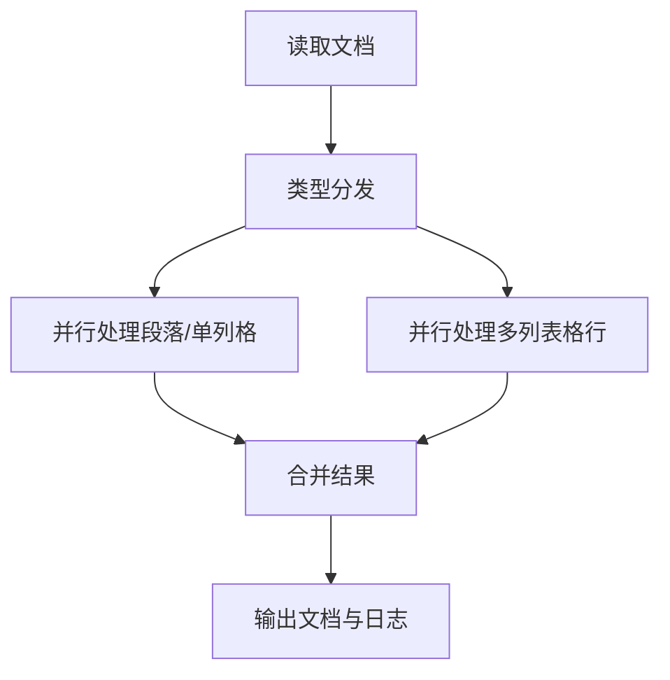
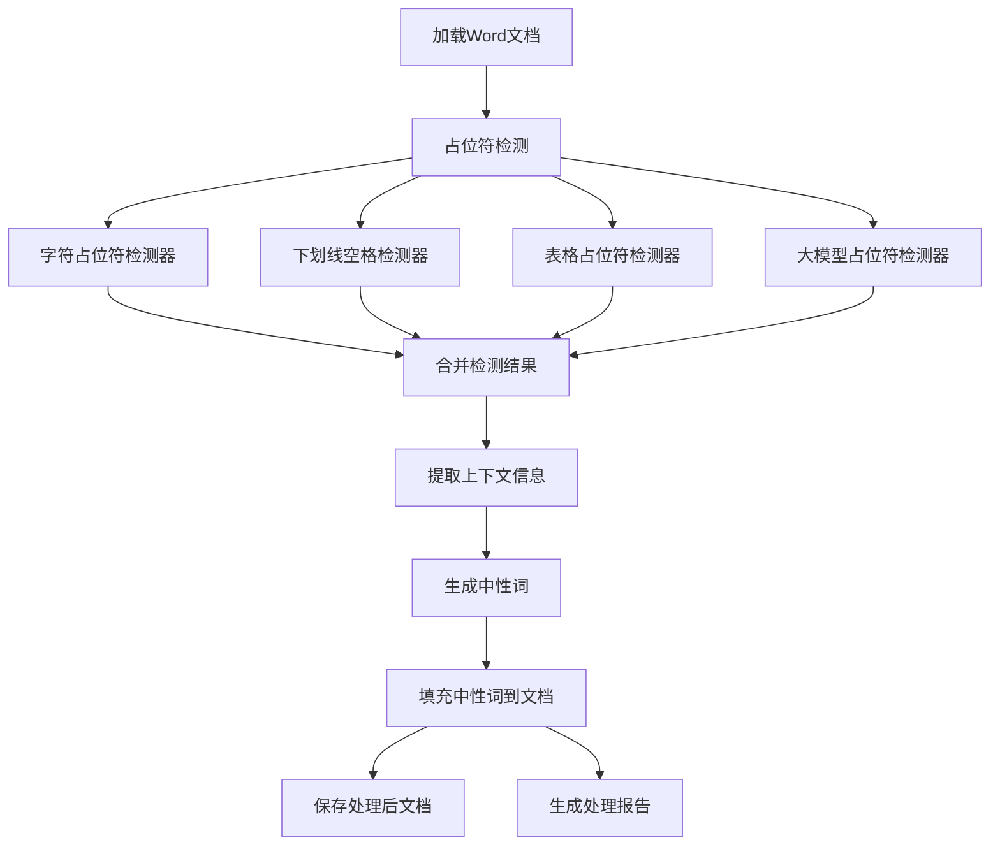

**设计说明**

最初的设计方案是仅让大模型负责中性词的生成，而占位符的检测与回填则需手动编写相应的代码实现。这样做虽然在检测和回填的精准度上有保障，但随着实际应用中Word格式的多样化、占位符类型的不断增加，每新增一种占位符都需要额外开发检测和回填逻辑，维护成本较高。

实际上，Word文档的底层结构由段落和run块组成，虽然格式各异，但都可以抽取出纯文本内容。基于这一点，我们可以将文本整理成统一的结构化格式交给大模型处理，让大模型同时完成占位符检测、中性词生成与回填，从而具备更好的泛化能力，适应更多样化的Word文档场景。

**小结一下**：
1. 半自动模式：大模型只负责生成中性词。
- 优点：占位符检测和回填的准确率高。
- 缺点：开发和维护工作量大，每种占位符都需手动编写检测与回填代码。
2. 全自动模式：大模型负责占位符检测、中性词生成和回填。
- 优点：具备一定的泛化能力，能够适配多种类型的Word文档和占位符。
- 缺点：检测和回填的准确率略低于手动实现，可能存在遗漏或错误，大部分没有问题。

**用法（全自动）**
python llm_detector/main.py input --output-dir ./output
input: 输入文件路径，可多个

两种模型的README合在了一起：

# Word文档中性词解析填充工具

该工具用于智能解析Word文档中的待填写位置，利用大模型生成准确的"中性词"描述，并将其填回文档中，保持原有格式不变。

## 大模型全自动模式

### 1. 项目背景与目标


本项目旨在实现一个**基于大模型的Word文档中性词检测与回填App**，区别于传统的正则/手工检测方式，充分利用大模型的理解与生成能力，自动识别Word文档中的待填词（如占位符、敏感词等），并生成中性词进行回填。 


### 2. 高层流程设计（Flow Design）

#### 总体流程

1. **批量文档读取节点**：批量读取多个Word文档内容，提取每个文档的段落和表格结构。
2. **类型分发节点**：遍历所有元素，分发为"段落/单列格/多列表格行"任务列表。
3. **并行大模型处理节点**：
   - 段落/单列格：并行处理，prompt与原段落一致。
   - 多列表格行：并行处理，prompt包含整行内容，要求大模型输出每列是否需要填写及中性词。
4. **结果合并节点**：合并所有回填结果，生成最终文档和日志。
5. **输出节点**：保存或返回所有处理后的文档及解析日志。

> 说明：类型分发节点将不同类型任务分流，后续节点专注于各自处理逻辑，便于维护和扩展。

#### Mermaid流程图



---

### 3. 关键节点与数据流（Node Design）

- **类型**：
  - 文档批量处理采用`BatchFlow`。
  - 类型分发采用`Node`或`BatchNode`。
  - 段落/单列格处理采用`AsyncParallelBatchNode`。
  - 多列表格行处理采用`AsyncParallelBatchNode`。
  - 合并与输出采用`Node`。
- **数据流**：PocketFlow推荐的`shared store`，核心数据结构如下：

```python
shared = {
    "doc_paths": [...],
    "docs": [...],  # 结构化文档对象
    "dispatch_tasks": [  # 由DispatchNode生成
        {"type": "paragraph", ...},
        {"type": "table_cell", ...},   # 单列表格格
        {"type": "table_row", ...},    # 多列表格行
        ...
    ],
    "para_results": [...],      # 段落/单列格处理结果
    "table_row_results": [...], # 多列表格行处理结果
    "filled_paragraphs": [...],
    "filled_tables": [...],
    "parse_logs": [...],
    "output_paths": [...]
}
```

- **节点说明**：

| 节点名                | 类型                | 主要功能/说明                         |
|-----------------------|---------------------|---------------------------------------|
| BatchReadDocNode      | Regular/Batch       | 读取文档，提取段落和表格结构          |
| DispatchNode          | Batch/Regular       | 遍历所有元素，分发为"段落/单列格/多列表格行"任务列表 |
| ParaLLMFillNode       | AsyncParallelBatch  | 并行处理段落和单列表格格（同段落处理）|
| TableRowLLMFillNode   | AsyncParallelBatch  | 并行处理多列表格的每一行（整行送大模型，特殊提示词）|
| MergeResultNode       | Regular             | 合并所有回填结果，生成最终文档和日志   |
| OutputDocNode         | Regular             | 保存文档、输出日志                    |

---

### 4. 解析日志设计

- **日志内容**：每次大模型处理后，需输出结构化日志，字段包括：
  - type: "paragraph"、"table_cell" 或 "table_row"
  - para_id: 段落编号（或表格内段落编号）
  - run_id: run编号
  - neutral_term: 替换的中性词
  - table_id: 表格编号（如适用）
  - row_id: 行编号（如适用）
  - col_id: 列编号（如适用）
- **日志用途**：便于下游任务追踪、审核、二次处理、可视化等。
- **建议**：日志结构可直接由大模型输出YAML/JSON，或由节点后处理生成。

---

### 5. 复用与扩展

- **大模型能力复用**：所有与大模型交互均通过`llm_client.py`封装，支持chat、结构化、YAML解析等。
- **工具函数**：如Word文档批量读写、段落/表格处理、文本替换等可放在`llm_detector/utils/`下，便于单元测试和复用。
- **可扩展性**：后续可支持多文档多格式、异步/并发、更多类型的词检测等。

---

### 6. 目录结构

```
llm_detector/
├── README.md           # 设计文档（本文件）
├── flow.py             # PocketFlow主流程定义
├── nodes.py            # 各节点实现
├── utils/              # 工具函数（如word批量读写、段落/表格处理等）
│   └── ...
└── main.py             # 入口，加载flow并运行
```

---

## 📑 半自动模式

- **多类型占位符智能识别**：支持下划线、方括号、花括号、空白处等多种占位符形式
- **上下文感知提取**：智能提取占位符周围的上下文，辅助理解填写内容
- **大模型生成中性词**：利用先进的大模型生成准确描述该位置的中性词
- **表格自动处理**：智能识别并处理表格中的待填写单元格
- **格式保持填充**：填充内容时保持文档原有格式
  > **支持Word段落中占位符跨run的情况**：  
  > 本工具在替换占位符时，会自动检测占位符是否跨越多个Word的run（即不同格式的文本块）。如果占位符跨run，系统会拼接所有run的文本，精准定位占位符的全局位置，仅修改涉及占位符的run内容，其余run保持不变，从而**最大程度保证Word文档的原有格式（如加粗、颜色、字体等）不被破坏**。  
  > 对于无法跨run定位的特殊占位符（如下划线空格、LLM智能检测等），则自动回退为run内替换，兼容所有类型的占位符检测器。
- **处理报告生成**：自动生成处理统计报告

## 🔍 占位符智能识别

本项目能识别多种类型的占位符：

- **字符占位符**：下划线(`_____`)、星号(`*****`)、短横线(`-----`)等
- **标记占位符**：方括号(`[填写内容]`)、花括号(`{请输入}`)等
- **表格占位符**：表格中的空单元格，自动使用表头作为填充提示
- **下划线空格占位符**：带有下划线格式的空格，常用于正式文档中
- **大模型智能检测**：分析文档语义，识别特殊占位符

> **占位符替换机制说明**：  
> - 检测器会为每个占位符记录其在原文中的精确位置（包括跨run的情况），并在替换时优先采用跨run精准替换，保证文档格式不变。  
> - 若占位符无法跨run定位，则自动回退为run内替换，兼容所有检测器类型。  
> - 这样无论占位符如何分布在Word文档中，都能被准确替换且格式不丢失。

## 📊 项目流程图




## 🚀 使用方法

### 代码调用

```python
from src.app.processor import DocumentProcessor

# 初始化处理器
processor = DocumentProcessor()

# 处理文档
result = processor.process("input.docx", "output.docx")

# 查看处理报告
print(result.report)
```

### 命令行使用

```bash
# 基本用法
python -m src.app.processor process-document your_file.docx

# 指定输出文件
python -m src.app.processor process-document your_file.docx --output-path result.docx
```

## 🧩 项目结构

```
项目根目录/
├── README.md             # 项目说明文档
├── requirements.txt      # 项目依赖
├── .env.example          # 环境变量配置示例
├── src/                  # 源代码
│   ├── app/              # 应用层代码
│   │   └── processor.py  # 文档处理主程序
│   ├── config/           # 项目配置
│   │   └── settings.py   # 配置项定义
│   ├── data/             # 数据处理模块
│   │   ├── models.py     # 数据模型定义
│   │   ├── document_handler.py       # 文档处理器
│   │   ├── document_filler.py        # 文档填充器
│   │   ├── document_io.py            # 文档IO操作
│   │   └── placeholder_detector/     # 占位符检测器
│   │       ├── base_detector.py      # 检测器基类
│   │       ├── character_detector.py # 字符占位符检测器
│   │       ├── llm_detector.py       # 大模型占位符检测器
│   │       ├── table_detector.py     # 表格占位符检测器
│   │       └── underline_space_detector.py # 下划线空格检测器
│   ├── service/          # 服务层
│   │   ├── filler.py     # 填充服务
│   │   ├── parser.py     # 解析服务
│   │   └── llm_client.py # 大模型客户端
└── tests/                # 测试文件夹
```

## 📝 示例效果

原始文档（含占位符）:
```
患者姓名: _______，年龄: _______，性别: _______。
入院日期: [填写日期]，出院日期: {出院日期}。
```

处理后文档:
```
患者姓名: {{姓名}}，年龄: {{年龄}}，性别: {{性别}}。
入院日期: {{入院日期}}，出院日期: {{出院日期}}。
```


# 补充：Word文档占位符检测与替换机制说明

对Word文档中占位符的智能检测与格式无损替换，尤其是对Word原生run结构的兼容。

## 检测器与占位符类型

- 支持多种占位符检测器，包括字符占位符检测器、下划线空格检测器、表格占位符检测器、大模型占位符检测器等。
- 每个检测器会为占位符记录其在原文中的精确位置（包括跨run的情况），并在替换时优先采用跨run精准替换，保证文档格式不变。

## 跨run替换机制

- Word文档的一个段落（paragraph）通常会被拆分成多个run，每个run代表一段连续的、格式一致的文本。
- 本项目在替换占位符时，会自动检测占位符是否跨越多个run。若是，系统会拼接所有run的文本，精准定位占位符的全局位置，仅修改涉及占位符的run内容，其余run保持不变，从而最大程度保证Word文档的原有格式（如加粗、颜色、字体等）不被破坏。
- 对于无法跨run定位的特殊占位符（如下划线空格、LLM智能检测等），则自动回退为run内替换，兼容所有类型的占位符检测器。

## 相关文件

- [src/data/document_filler.py](mdc:src/data/document_filler.py)：实现了跨run与run内的智能替换逻辑，详见`_fill_text_placeholder`、`_try_replace_cross_run`、`_replace_in_single_run`等方法。
- [src/data/placeholder_detector/character_detector.py](mdc:src/data/placeholder_detector/character_detector.py)：字符占位符检测器，支持跨run定位。
- [src/data/models.py](mdc:src/data/models.py)：`PlaceholderInfo`数据结构，支持记录原始占位符字符串（raw_text）及其位置。

## 典型流程

1. 检测器扫描文档，识别所有占位符，并记录其原文、位置、run索引等信息。
2. 替换时，优先尝试跨run精准替换，若无法定位则回退为run内替换。
3. 替换过程中run对象本身不变，最大程度保留原有格式。

## 参考

- 详见[README.md](mdc:README.md)“格式保持填充”与“占位符替换机制说明”部分。
