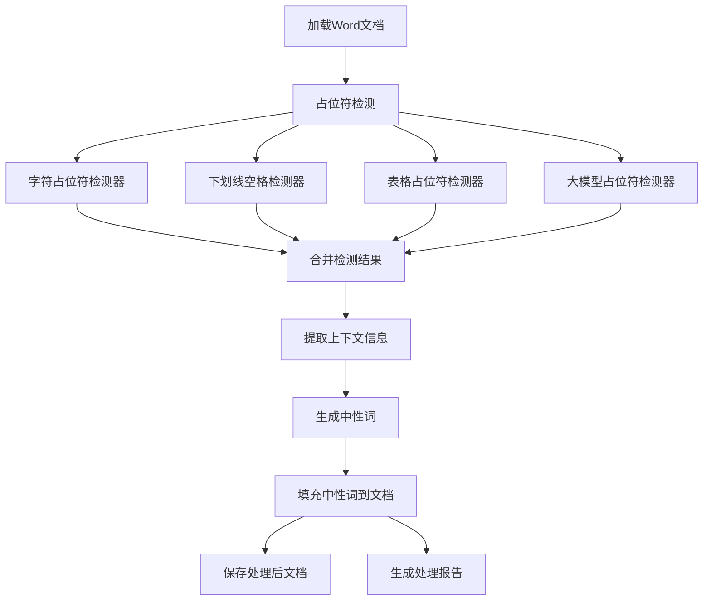

难点/问题
1. 占位符格式：普通下划线、空格下划线、其他字符、表格
2. 表格不需要大模型生成中性词，直接用表头。其他情况再特殊处理
3. 大模型根据上下文生成中性词可能会有问题。
4. 换行的占位符，行尾和行首
5. 格式优化：输出的正好放到中间，而不是最左侧


# Word文档中性词解析填充工具

该工具用于智能解析Word文档中的待填写位置，利用大模型生成准确的"中性词"描述，并将其填回文档中，保持原有格式不变。

## 📑 主要功能

- **多类型占位符智能识别**：支持下划线、方括号、花括号、空白处等多种占位符形式
- **上下文感知提取**：智能提取占位符周围的上下文，辅助理解填写内容
- **大模型生成中性词**：利用先进的大模型生成准确描述该位置的中性词
- **表格自动处理**：智能识别并处理表格中的待填写单元格
- **格式保持填充**：填充内容时保持文档原有格式
- **处理报告生成**：自动生成处理统计报告

## 🔍 占位符智能识别

本项目能识别多种类型的占位符：

- **字符占位符**：下划线(`_____`)、星号(`*****`)、短横线(`-----`)等
- **标记占位符**：方括号(`[填写内容]`)、花括号(`{请输入}`)等
- **表格占位符**：表格中的空单元格，自动使用表头作为填充提示
- **下划线空格占位符**：带有下划线格式的空格，常用于正式文档中
- **大模型智能检测**：分析文档语义，识别特殊占位符

## 📊 项目流程图




## 🚀 使用方法

### 代码调用

```python
from src.app.processor import DocumentProcessor

# 初始化处理器
processor = DocumentProcessor()

# 处理文档
result = processor.process("input.docx", "output.docx")

# 查看处理报告
print(result.report)
```

### 命令行使用

```bash
# 基本用法
python -m src.app.processor process-document your_file.docx

# 指定输出文件
python -m src.app.processor process-document your_file.docx --output-path result.docx
```

## 🧩 项目结构

```
项目根目录/
├── README.md             # 项目说明文档
├── requirements.txt      # 项目依赖
├── .env.example          # 环境变量配置示例
├── src/                  # 源代码
│   ├── app/              # 应用层代码
│   │   └── processor.py  # 文档处理主程序
│   ├── config/           # 项目配置
│   │   └── settings.py   # 配置项定义
│   ├── data/             # 数据处理模块
│   │   ├── models.py     # 数据模型定义
│   │   ├── document_handler.py       # 文档处理器
│   │   ├── document_filler.py        # 文档填充器
│   │   ├── document_io.py            # 文档IO操作
│   │   └── placeholder_detector/     # 占位符检测器
│   │       ├── base_detector.py      # 检测器基类
│   │       ├── character_detector.py # 字符占位符检测器
│   │       ├── llm_detector.py       # 大模型占位符检测器
│   │       ├── table_detector.py     # 表格占位符检测器
│   │       └── underline_space_detector.py # 下划线空格检测器
│   ├── service/          # 服务层
│   │   ├── filler.py     # 填充服务
│   │   ├── parser.py     # 解析服务
│   │   └── llm_client.py # 大模型客户端
└── tests/                # 测试文件夹
```

## 📝 示例效果

原始文档（含占位符）:
```
患者姓名: _______，年龄: _______，性别: _______。
入院日期: [填写日期]，出院日期: {出院日期}。
```

处理后文档:
```
患者姓名: {{姓名}}，年龄: {{年龄}}，性别: {{性别}}。
入院日期: {{入院日期}}，出院日期: {{出院日期}}。
```