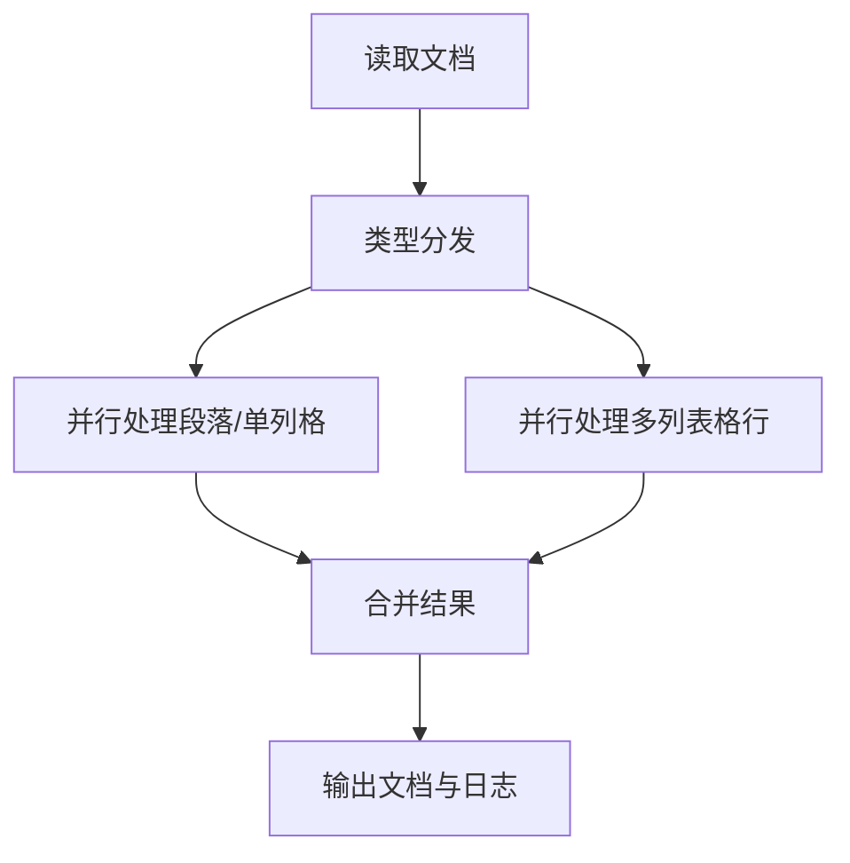

## 设计文档

### 1. 项目背景与目标

本项目旨在实现一个**基于大模型的Word文档中性词检测与回填App**，区别于传统的正则/手工检测方式，充分利用大模型的理解与生成能力，自动识别Word文档中的待填词（如占位符、敏感词等），并生成中性词进行回填。  
本App将完全基于PocketFlow框架实现，具备如下特性：

- **自动化**：无需手工标注或规则，直接由大模型检测与生成。
- **可复用性**：复用已有的`llm_client.py`大模型能力。
- **模块化**：流程解耦，便于扩展和维护。
- **高可用**：支持结构化输出、异常处理、日志追踪等。
- **批量与并行**：支持多Word文档批量处理，段落级并行检测与生成，提升效率。
- **类型分发**：支持段落、单列格、多列表格行的分流与独立处理，适配复杂表格。
- **可追溯日志**：每次解析均输出详细日志，便于下游任务追踪和复用。

---

### 2. 高层流程设计（Flow Design）

#### 总体流程

1. **批量文档读取节点**：批量读取多个Word文档内容，提取每个文档的段落和表格结构。
2. **类型分发节点**：遍历所有元素，分发为"段落/单列格/多列表格行"任务列表。
3. **并行大模型处理节点**：
   - 段落/单列格：并行处理，prompt与原段落一致。
   - 多列表格行：并行处理，prompt包含整行内容，要求大模型输出每列是否需要填写及中性词。
4. **结果合并节点**：合并所有回填结果，生成最终文档和日志。
5. **输出节点**：保存或返回所有处理后的文档及解析日志。

> 说明：类型分发节点将不同类型任务分流，后续节点专注于各自处理逻辑，便于维护和扩展。

#### Mermaid流程图



---

### 3. 关键节点与数据流（Node Design）

- **类型**：
  - 文档批量处理采用`BatchFlow`。
  - 类型分发采用`Node`或`BatchNode`。
  - 段落/单列格处理采用`AsyncParallelBatchNode`。
  - 多列表格行处理采用`AsyncParallelBatchNode`。
  - 合并与输出采用`Node`。
- **数据流**：PocketFlow推荐的`shared store`，核心数据结构如下：

```python
shared = {
    "doc_paths": [...],
    "docs": [...],  # 结构化文档对象
    "dispatch_tasks": [  # 由DispatchNode生成
        {"type": "paragraph", ...},
        {"type": "table_cell", ...},   # 单列表格格
        {"type": "table_row", ...},    # 多列表格行
        ...
    ],
    "para_results": [...],      # 段落/单列格处理结果
    "table_row_results": [...], # 多列表格行处理结果
    "filled_paragraphs": [...],
    "filled_tables": [...],
    "parse_logs": [...],
    "output_paths": [...]
}
```

- **节点说明**：

| 节点名                | 类型                | 主要功能/说明                         |
|-----------------------|---------------------|---------------------------------------|
| BatchReadDocNode      | Regular/Batch       | 读取文档，提取段落和表格结构          |
| DispatchNode          | Batch/Regular       | 遍历所有元素，分发为"段落/单列格/多列表格行"任务列表 |
| ParaLLMFillNode       | AsyncParallelBatch  | 并行处理段落和单列表格格（同段落处理）|
| TableRowLLMFillNode   | AsyncParallelBatch  | 并行处理多列表格的每一行（整行送大模型，特殊提示词）|
| MergeResultNode       | Regular             | 合并所有回填结果，生成最终文档和日志   |
| OutputDocNode         | Regular             | 保存文档、输出日志                    |

---

### 4. 解析日志设计

- **日志内容**：每次大模型处理后，需输出结构化日志，字段包括：
  - type: "paragraph"、"table_cell" 或 "table_row"
  - para_id: 段落编号（或表格内段落编号）
  - run_id: run编号
  - neutral_term: 替换的中性词
  - table_id: 表格编号（如适用）
  - row_id: 行编号（如适用）
  - col_id: 列编号（如适用）
- **日志用途**：便于下游任务追踪、审核、二次处理、可视化等。
- **建议**：日志结构可直接由大模型输出YAML/JSON，或由节点后处理生成。

---

### 5. 复用与扩展

- **大模型能力复用**：所有与大模型交互均通过`llm_client.py`封装，支持chat、结构化、YAML解析等。
- **工具函数**：如Word文档批量读写、段落/表格处理、文本替换等可放在`llm_detector/utils/`下，便于单元测试和复用。
- **可扩展性**：后续可支持多文档多格式、异步/并发、更多类型的词检测等。

---

### 6. 目录结构

```
llm_detector/
├── README.md           # 设计文档（本文件）
├── flow.py             # PocketFlow主流程定义
├── nodes.py            # 各节点实现
├── utils/              # 工具函数（如word批量读写、段落/表格处理等）
│   └── ...
└── main.py             # 入口，加载flow并运行
```

---